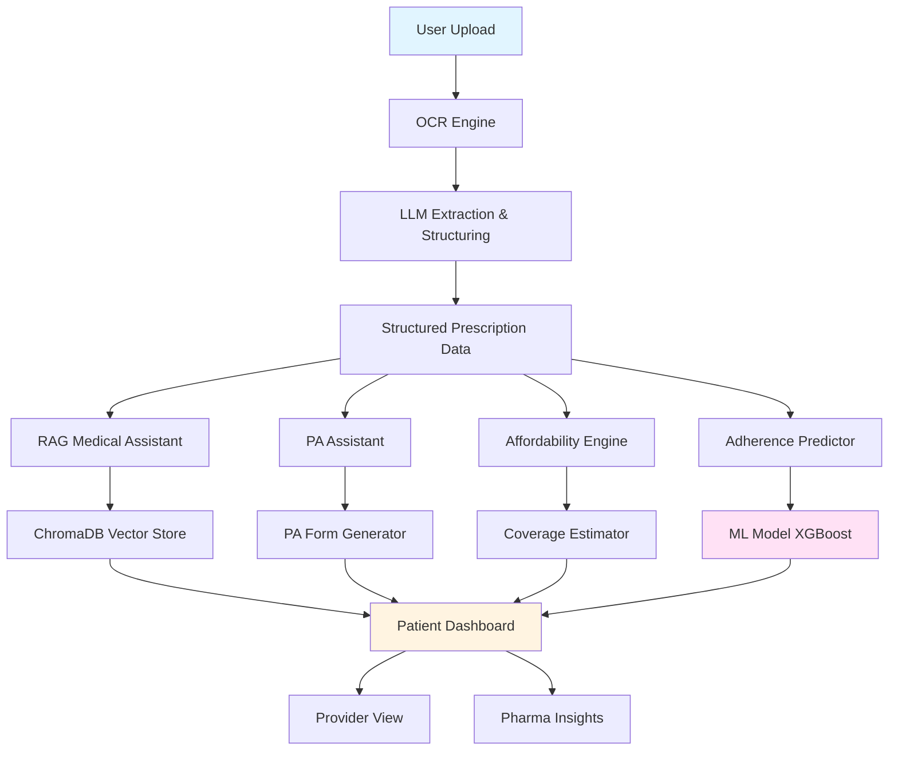

# RxAccess AI — Intelligent Prescription Access & Adherence Platform

[](https://rxaccess-ai.streamlit.app/)

> **🚀 Try it live:** [https://rxaccess-ai.streamlit.app](https://rxaccess-ai.streamlit.app/)

---

## 🎯 Project Overview

RxAccess AI is a production-grade healthcare AI prototype that demonstrates end-to-end capabilities for prescription management, patient access, prior authorization, affordability insights, and adherence intelligence. This platform closely mirrors real-world challenges solved by health-tech companies like PHIL.

## 🏥 Alignment with PHIL's Mission

This platform addresses key healthcare challenges:

- **Prescription Access**: Intelligent OCR and extraction from images/PDFs
- **Prior Authorization**: Automated PA form generation, status tracking, and approval prediction
- **Affordability**: Insurance coverage estimation and patient assistance program recommendations
- **Adherence Intelligence**: ML-powered risk prediction and personalized interventions
- **Multi-Stakeholder Support**: Dashboards for patients, providers, pharmacies, and pharma companies

## 🏗️ Architecture



## 🚀 Features

### 1. Prescription Ingestion & Extraction
- Upload prescription images (JPG, PNG) or PDFs
- OCR using Tesseract with LLM-powered correction
- Extract: medicine name, dosage, frequency, duration, doctor info, patient details
- Structured JSON output with confidence scores

### 2. RAG-Powered Medical Assistant
- Ask questions about uploaded prescriptions
- Knowledge base with drug information, interactions, side effects
- ChromaDB vector store for semantic search
- Context-aware responses using LangChain

### 3. Prior Authorization Assistant
- Automated PA form generation
- Required documentation checklist
- Approval likelihood prediction
- Status tracking (Pending → Under Review → Approved/Denied)
- Missing information alerts

### 4. Affordability & Access Intelligence
- Insurance coverage estimation
- Copay calculator
- Patient assistance program recommendations
- Cash-pay vs insurance comparison
- Generic alternatives suggestions

### 5. Adherence Prediction & Personalization
- XGBoost ML model for adherence risk scoring
- Features: age, medication class, regimen complexity, past adherence
- Personalized intervention generation
- Reminder scheduling with motivational messaging

### 6. Multi-Stakeholder Dashboards
- **Patient View**: Prescription details, Q&A, adherence score, reminders
- **Provider/Pharmacy View**: Extracted data, PA status, patient insights
- **Pharma Insights**: Aggregated metrics, adherence rates, PA success rates

## 🛠️ Tech Stack

| Component | Technology |
|-----------|-----------|
| Backend | Python 3.10+, FastAPI |
| Frontend | Streamlit |
| LLM Framework | LangChain |
| LLM Provider | Ollama (local) / Groq / OpenAI |
| Vector Store | ChromaDB |
| OCR | Tesseract + LLM correction |
| ML | scikit-learn, XGBoost |
| Deployment | Docker, AWS-ready |

## 📦 Installation

### Prerequisites
- Python 3.10+
- Docker (optional)
- Tesseract OCR

### Local Setup

1. **Clone the repository**
```bash
git clone <repository-url>
cd rxaccess-ai
```

2. **Install Tesseract OCR**

**Windows:**
```bash
# Download from: https://github.com/UB-Mannheim/tesseract/wiki
# Add to PATH
```

**macOS:**
```bash
brew install tesseract
```

**Linux:**
```bash
sudo apt-get install tesseract-ocr
```

3. **Create virtual environment**
```bash
python -m venv venv
source venv/bin/activate  # On Windows: venv\Scripts\activate
```

4. **Install dependencies**
```bash
pip install -r requirements.txt
```

5. **Set up environment variables**
```bash
cp .env.example .env
# Edit .env with your API keys
```

6. **Initialize the system**
```bash
python scripts/init_system.py
```

### Docker Setup

```bash
docker build -t rxaccess-ai .
docker run -p 8501:8501 -p 8000:8000 rxaccess-ai
```

## 🎮 Usage

### Start the Application

```bash
streamlit run streamlit_app/app.py
```

Access at: `http://localhost:8501`

### Demo Flow

1. **Upload Prescription**
   - Navigate to "📄 Upload Prescription" tab
   - Upload image or PDF
   - View extracted structured data

2. **Ask Questions**
   - Go to "💬 Medical Assistant" tab
   - Ask about side effects, interactions, dosage instructions
   - Get AI-powered responses with sources

3. **Check Prior Authorization**
   - Visit "📋 Prior Authorization" tab
   - Review PA form summary
   - Check approval likelihood
   - Track submission status

4. **Explore Affordability**
   - Open "💰 Affordability" tab
   - View insurance coverage estimate
   - Compare cash-pay options
   - Find patient assistance programs

5. **View Adherence Insights**
   - Check "📊 Adherence Intelligence" tab
   - See risk score prediction
   - Review personalized interventions
   - Set up reminders

6. **Multi-Stakeholder Views**
   - Switch between Patient, Provider, and Pharma dashboards
   - Explore role-specific insights

## 📁 Project Structure

```
rxaccess-ai/
├── streamlit_app/
│   ├── app.py                      # Main Streamlit application
│   ├── pages/
│   │   ├── 1_upload.py            # Prescription upload
│   │   ├── 2_assistant.py         # RAG medical assistant
│   │   ├── 3_prior_auth.py        # PA assistant
│   │   ├── 4_affordability.py     # Affordability engine
│   │   ├── 5_adherence.py         # Adherence intelligence
│   │   └── 6_dashboards.py        # Multi-stakeholder views
│   └── components/
│       ├── sidebar.py             # Shared sidebar
│       └── utils.py               # UI utilities
├── src/
│   ├── extraction/
│   │   ├── ocr_engine.py          # Tesseract OCR
│   │   └── llm_extractor.py       # LLM-based extraction
│   ├── rag/
│   │   ├── vector_store.py        # ChromaDB setup
│   │   ├── retriever.py           # RAG retriever
│   │   └── qa_chain.py            # Q&A chain
│   ├── prior_auth/
│   │   ├── pa_generator.py        # PA form generation
│   │   ├── approval_predictor.py  # Approval likelihood
│   │   └── status_tracker.py      # Status management
│   ├── affordability/
│   │   ├── coverage_estimator.py  # Insurance coverage
│   │   └── assistance_finder.py   # Patient assistance
│   ├── adherence/
│   │   ├── risk_predictor.py      # ML risk model
│   │   ├── intervention_gen.py    # Personalized interventions
│   │   └── model_trainer.py       # Model training
│   ├── utils/
│   │   ├── pii_redaction.py       # PII handling
│   │   ├── disclaimer.py          # Legal disclaimers
│   │   └── logger.py              # Logging setup
│   └── config.py                  # Configuration
├── backend/
│   ├── main.py                    # FastAPI application
│   ├── routes/
│   │   ├── extraction.py          # Extraction endpoints
│   │   ├── rag.py                 # RAG endpoints
│   │   ├── prior_auth.py          # PA endpoints
│   │   └── adherence.py           # Adherence endpoints
│   └── models/
│       └── schemas.py             # Pydantic models
├── models/
│   ├── adherence_model.pkl        # Trained XGBoost model
│   └── scaler.pkl                 # Feature scaler
├── data/
│   ├── knowledge_base/
│   │   ├── drug_info.json         # Drug information
│   │   ├── interactions.json      # Drug interactions
│   │   └── side_effects.json      # Side effects database
│   ├── synthetic/
│   │   ├── prescriptions/         # Sample prescriptions
│   │   ├── patient_data.csv       # Synthetic patient data
│   │   └── adherence_data.csv     # Training data
│   └── uploads/                   # User uploads
├── evaluation/
│   ├── extraction_eval.py         # OCR accuracy metrics
│   ├── rag_eval.py                # RAG faithfulness
│   ├── model_eval.py              # ML model performance
│   └── results/                   # Evaluation results
├── scripts/
│   ├── init_system.py             # System initialization
│   ├── generate_synthetic_data.py # Data generation
│   └── train_adherence_model.py   # Model training
├── docs/
│   ├── ARCHITECTURE.md            # Detailed architecture
│   ├── API.md                     # API documentation
│   ├── DEPLOYMENT.md              # Deployment guide
│   └── SECURITY.md                # Security considerations
├── tests/
│   ├── test_extraction.py
│   ├── test_rag.py
│   ├── test_prior_auth.py
│   └── test_adherence.py
├── .env.example                   # Environment template
├── .gitignore
├── requirements.txt
├── Dockerfile
├── docker-compose.yml
└── README.md
```

## 🔧 Configuration

Edit `.env` file:

```env
# LLM Configuration
LLM_PROVIDER=ollama  # ollama, groq, openai
OLLAMA_MODEL=llama3.1
GROQ_API_KEY=your_groq_key
OPENAI_API_KEY=your_openai_key

# Vector Store
CHROMA_PERSIST_DIR=./data/chroma_db

# OCR
TESSERACT_PATH=/usr/bin/tesseract

# AWS (Optional)
AWS_ACCESS_KEY_ID=your_key
AWS_SECRET_ACCESS_KEY=your_secret
AWS_REGION=us-east-1

# Application
DEBUG=True
LOG_LEVEL=INFO
```

## 📊 Evaluation Metrics

### Extraction Accuracy
- Character Error Rate (CER)
- Word Error Rate (WER)
- Field-level accuracy (medicine name, dosage, etc.)

### RAG Performance
- Faithfulness score
- Answer relevancy
- Context precision/recall

### ML Model Performance
- Adherence prediction: AUC-ROC, F1-score, precision, recall
- Feature importance analysis

Run evaluation:
```bash
python evaluation/run_all_evals.py
```

## 🔒 Security & Compliance

### HIPAA Considerations
- PII redaction for sensitive data
- Encrypted data storage (implement in production)
- Audit logging for all access
- Role-based access control
- Secure API endpoints with authentication

### Disclaimers
- "Not medical advice" disclaimer on all outputs
- "For demonstration purposes only" notice
- Recommendation to consult healthcare professionals

## 🚀 Deployment

### AWS Deployment

1. **S3 for file storage**
```bash
aws s3 mb s3://rxaccess-ai-uploads
```

2. **ECR for Docker images**
```bash
aws ecr create-repository --repository-name rxaccess-ai
docker tag rxaccess-ai:latest <account>.dkr.ecr.us-east-1.amazonaws.com/rxaccess-ai
docker push <account>.dkr.ecr.us-east-1.amazonaws.com/rxaccess-ai
```

3. **ECS/Fargate for containers**
```bash
# Use provided CloudFormation template
aws cloudformation create-stack --stack-name rxaccess-ai --template-body file://deploy/cloudformation.yml
```

See `docs/DEPLOYMENT.md` for detailed instructions.

## 🧪 Testing

```bash
# Run all tests
pytest tests/

# Run specific test suite
pytest tests/test_extraction.py -v

# Run with coverage
pytest --cov=src tests/
```

## 📈 Future Improvements

### Short-term
- [ ] Real-time prescription verification with pharmacy databases
- [ ] Multi-language support for prescriptions
- [ ] Mobile app integration
- [ ] SMS/Email reminder system
- [ ] Integration with EHR systems (HL7 FHIR)

### Medium-term
- [ ] Advanced PA automation with payer API integration
- [ ] Real-time insurance eligibility verification
- [ ] Predictive analytics for medication shortages
- [ ] Blockchain for prescription authenticity
- [ ] Telemedicine integration

### Long-term
- [ ] Clinical trial matching based on prescriptions
- [ ] Pharmacogenomics integration
- [ ] Real-world evidence generation
- [ ] Population health analytics
- [ ] AI-powered formulary optimization

## 🤝 Contributing

Contributions are welcome! Please read our contributing guidelines and submit pull requests.

## 📄 License

MIT License - see LICENSE file for details.

## 🙏 Acknowledgments

- Inspired by PHIL's mission to improve prescription access and adherence
- Built with open-source AI/ML tools
- Synthetic data generated for demonstration purposes

## 📞 Contact

For questions or support, please open an issue or contact the development team.

---

**⚠️ IMPORTANT DISCLAIMER**: This is a prototype for demonstration purposes only. Not intended for actual medical use. Always consult healthcare professionals for medical advice.
